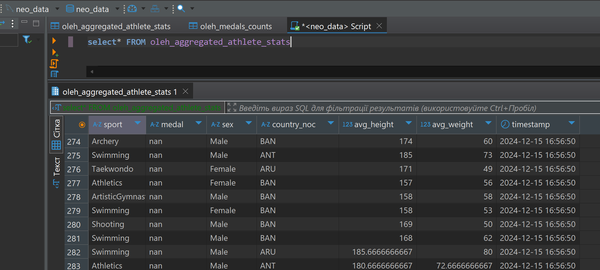
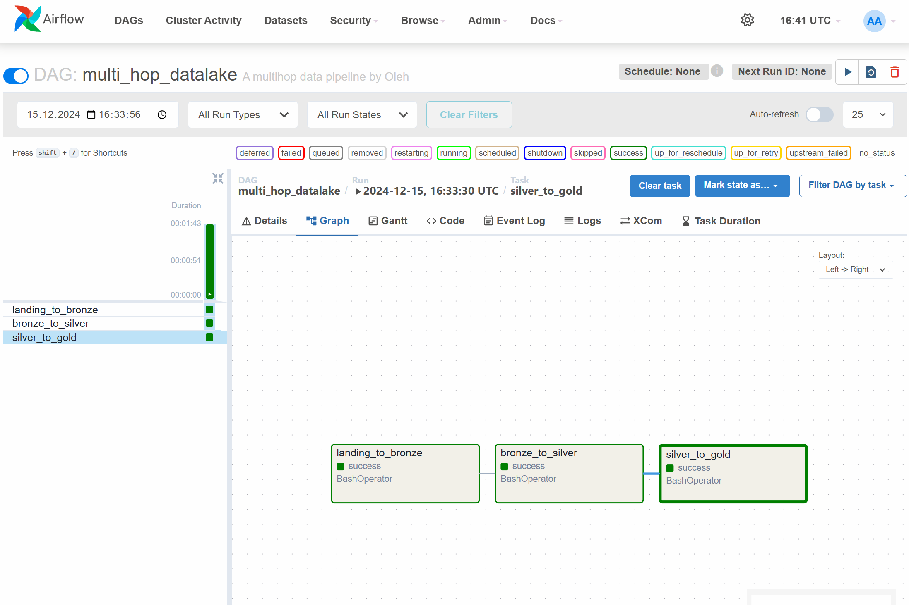
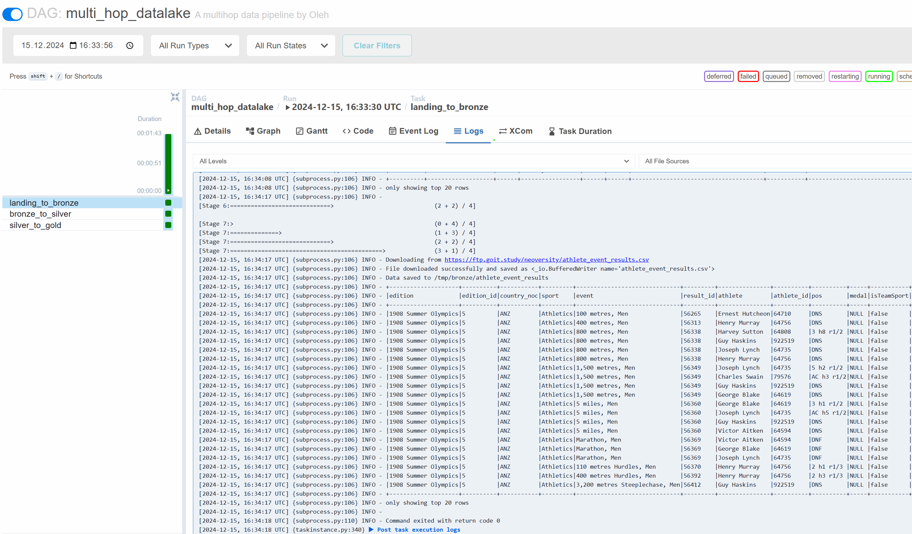
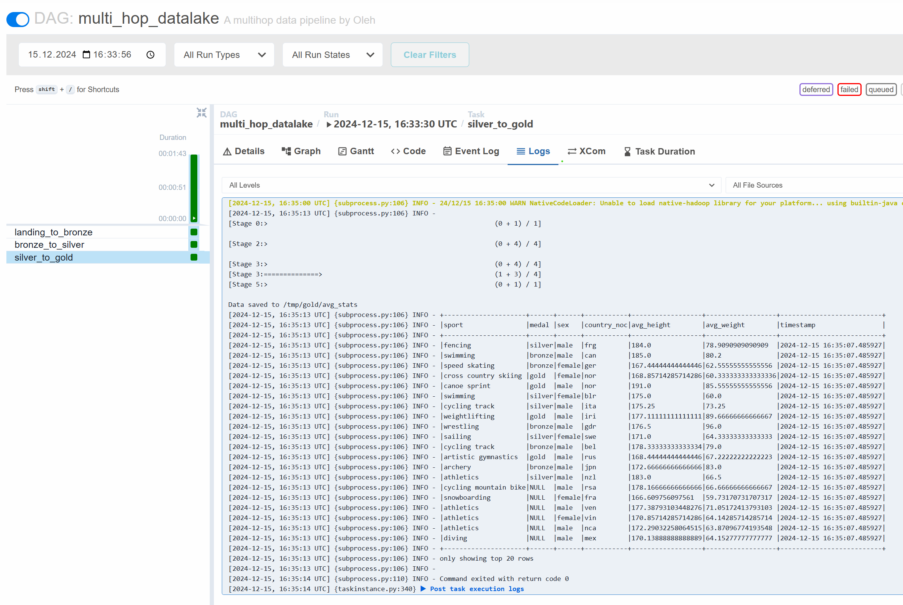

# goit-de-fp

<!-- mkdir -p ./dags ./logs ./plugins ./config
echo -e "AIRFLOW_UID=$(id -u)" > .env -->

### Висновки по частині 1:

1. **Зчитування фізичних показників атлетів з MySQL:**
   - Дані з таблиці `olympic_dataset.athlete_bio` успішно завантажені за допомогою Spark. Було використано оптимізацію з розділенням даних на партиції (`partitionColumn`, `lowerBound`, `upperBound`), що дозволило збільшити швидкість зчитування великих обсягів даних.

2. **Фільтрація даних:**
   - Дані, де значення зросту (`height`) та ваги (`weight`) були порожніми або нечисловими, було успішно відфільтровано. Це гарантує, що лише валідні дані потрапили до наступних етапів обробки.

3. **Робота з даними результатів змагань:**
   - Дані з таблиці `athlete_event_results` були завантажені з MySQL з використанням партицій.
   - Вони були записані у Kafka-топік `athlete_event_results` у форматі JSON.
   - З Kafka-топіку `athlete_event_results` дані було зчитано у Spark-стрім у форматі JSON та перетворено у DataFrame з окремими колонками.

4. **Об’єднання даних:**
   - Дані результатів змагань з Kafka були успішно об’єднані з біологічними даними з MySQL (`athlete_bio`) за ключем `athlete_id`. Це дозволило сформувати повну картину атлетів із їхніми біологічними характеристиками та результатами змагань.

5. **Розрахунок середніх показників:**
   - Розраховано середні значення зросту (`height`) і ваги (`weight`) для кожного виду спорту, типу медалі (або її відсутності), статі (`sex`) та країни (`country_noc`).
   - До розрахунків було додано колонку `timestamp` для збереження часу створення обчислень.

6. **Стрім даних:**
   - Результати обробки було організовано у стрімінговому форматі:
     - **а)** Дані були записані у вихідний Kafka-топік `oleh_aggregated_athlete_stats`, що дозволяє їх подальше використання для аналітики в реальному часі.
     - **b)** Дані були записані у базу даних MySQL (`oleh_aggregated_athlete_stats`), що забезпечує їхню доступність для подальших аналітичних запитів.

### Ключові особливості:
- Оптимізація зчитування MySQL-даних через партиціонування.
- Конвертація JSON-даних із Kafka у формат DataFrame.
- Використання `foreachBatch` для забезпечення запису оброблених даних як у Kafka, так і в MySQL.

### Висновки по частині 2:

У цьому проєкті створено простий multi-hop datalake, який ілюструє ключові етапи роботи з даними: 

1. **Landing to Bronze**: На першому етапі дані завантажуються з FTP-сервера в сирому форматі та зберігаються у форматі Parquet. Це забезпечує ефективне зберігання і базову структуризацію даних для подальшої обробки.

2. **Bronze to Silver**: На цьому кроці здійснюється очистка текстових колонок, видалення дублікатів і перетворення даних у більш стандартизований формат. Цей етап спрямований на підвищення якості даних для аналітичних цілей.

3. **Silver to Gold**: Завдяки джоінінгу кількох таблиць і агрегації даних створюється аналітично-готовий набір, що містить середні показники ваги та зросту для різних категорій спортсменів. Додавання часової мітки гарантує актуальність даних.

4. **Оркестрація через Airflow DAG**: Створення DAG дозволяє автоматизувати і послідовно виконувати всі етапи ETL-процесу, що забезпечує надійність і масштабованість системи.

